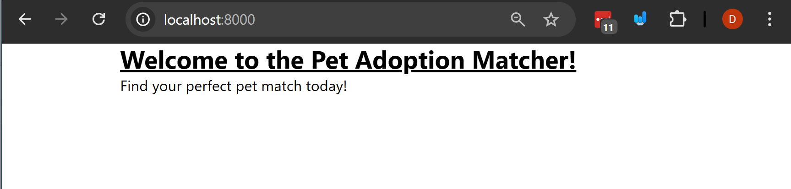
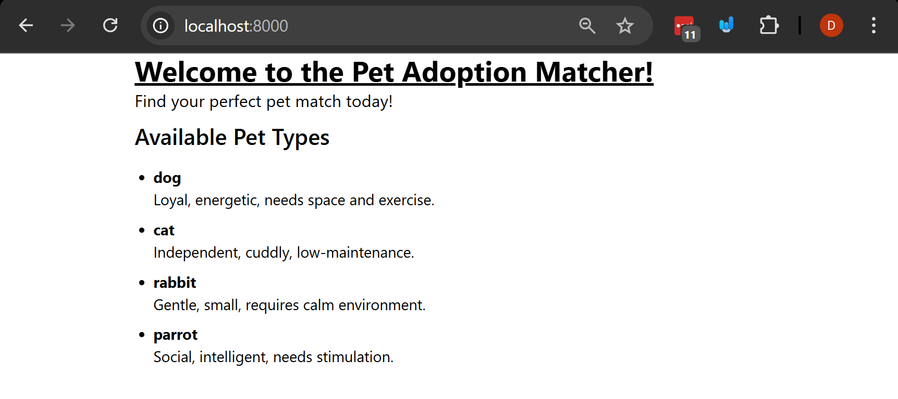
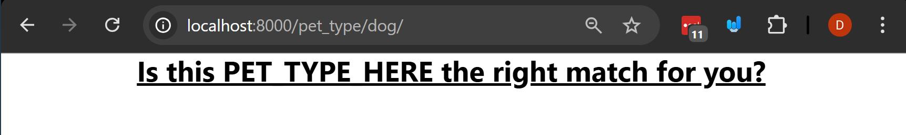
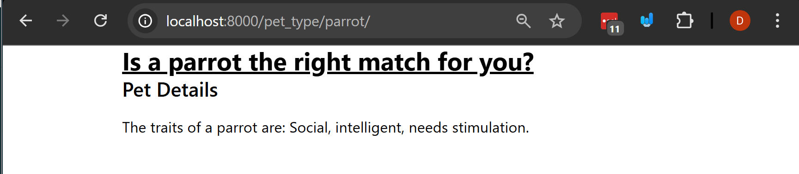
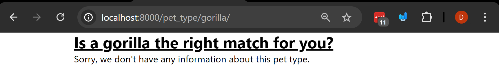

# Urls and Views Fundamentals

In this example we'll be learning how views and urls work togother.

Throughout the course we'll be using an architecture pattern called Model-View-Template (which is very closesly related to Model-View-Controller) that allows us to connect all of our code together while still being organized. Urls and views

Note these architecture patterns are used for almost every backend framework.

A url is a path to your website that will link to a "view" which is a special django function that you will take in a request and provide a response which will be data passed into a template which will be rendered with that data.


## Steps

### 1. Create a virtual envirnment and install Django
`python -m venv ./venv`

activate the virtual environment:
- linux/mac: `source ./venv/bin/activate`
- windows: `.\venv\Scripts\activate`

### 2. Install the requirements for the project from the requirements.txt file:
- check that you don't have the requirements installed already:
`pip freeze` this should show nothing if you just created the virtual environment.
- install the requirements:
`pip install -r requirements.txt`
- check that you have the requirements installed:
`pip freeze` this should show the requirements that are installed in the virtual environment.


### 4. Navigate inside the `urls_views_fundamentals` directory and initialize a new "app" named "pet_adoption"
- remember from the first example that when you're starting a new project you need to initialize the database tables.
`python manage.py migrate`
- let's create a new app called pet adoption helper
`python manage.py startapp pet_adoption`
- Note you should now see a new directory called `pet_adoption` in the project directory.


### 5. Let's add our first template to the `pet_adoption` app
- Create a folder called `templates` in the pet_adoption directory, and in that folder named `pet_adoption`
  - Django will look for templates in this directory.
  - Note: if you take a look at the `settings.py` file in the project directory, you'll see that this is where django will look for templates. With the lines
```python
TEMPLATES = [
    {
        "BACKEND": "django.template.backends.django.DjangoTemplates",
        "DIRS": [],
        "APP_DIRS": True,
        "OPTIONS": {
            "context_processors": [
                "django.template.context_processors.request",
                "django.contrib.auth.context_processors.auth",
                "django.contrib.messages.context_processors.messages",
            ],
        },
    },
]
```
- Inside the `pet_adoption/templates/pet_adoption` directory, copy the file called `home_page.html`, this will be our home page template.

### 6. Let's add our first view to the `pet_adoption` app
- The view is going to conatian the logic that will connect the url to the template, (we'll be adding the url next!).

- Open the `views.py` file in the `pet_adoption` directory and add the following code:
```python
from django.shortcuts import render

def home_page(request):
    # this where you'll do logic and pass data to the template!
    return render(request, "pet_adoption/home_page.html")
```
- now this view is going to return our template and we don't have any data to pass to, but we don't have this hooked up to a url yet, let's do that next.

### 7. Let's add our first url to the `pet_adoption` app
- Create a file called `urls.py` in the `pet_adoption` directory, this is where we'll add our urls for this app.
  - This file will hold the urls mapped to each view in the app.
- Open the `urls.py` file and add the following code:
```python
from django.urls import path
from .views import home_page
urlpatterns = [
    path("", home_page, name="home_page"),
]
```
- Now our entire project doesn't know about this url yet so we need to add it to the project level `urls.py` file.

### 8. Let's add our first url to the project level `urls.py` file
- Open the `urls_views_fundamentals/settings.py` and add the
`pet_adoption` app to the `INSTALLED_APPS` list:
```python

INSTALLED_APPS = [
    "django.contrib.admin",
    "django.contrib.auth",
    "django.contrib.contenttypes",
    "django.contrib.sessions",
    "django.contrib.messages",
    "django.contrib.staticfiles",

    # Custom apps
    "pet_adoption",
]
```
- Open the `urls_views_fundamentals/urls.py` file and add the following code:
```python
from django.contrib import admin
from django.urls import path, include # include is used to include urls from other apps
# import the urls from the pet_adoption app
from pet_adoption import urls as pet_adoption_urls

urlpatterns = [
    path("admin/", admin.site.urls),
    # include the urls from the pet_adoption app
    # this means that it's
    path("", include(pet_adoption_urls)),
]
```
- Now if you run the server with `python manage.py runserver` and go to `http://localhost:8000/` you should see the home page template rendered in the browser.
  - You it should look like this:

  

### 9. Let's add some data to the template
- Open the `views.py` file in the `pet_adoption` directory and add the following code and pass the data to the template:

```python
from django.shortcuts import render

PET_TYPES = {
    'dog': {
        'name': 'Dog',
        'traits': 'Loyal, energetic, needs space and exercise.',
        'lifestyle_fit': 'active'
    },
    'cat': {
        'name': 'Cat',
        'traits': 'Independent, cuddly, low-maintenance.',
        'lifestyle_fit': 'quiet'
    },
    'rabbit': {
        'name': 'Rabbit',
        'traits': 'Gentle, small, requires calm environment.',
        'lifestyle_fit': 'quiet'
    },
    'parrot': {
        'name': 'Parrot',
        'traits': 'Social, intelligent, needs stimulation.',
        'lifestyle_fit': 'social'
    }
}

# Create your views here.
def home_page(request):
    # we're passing in the dictionary of pets to the template
    return render(request, "pet_adoption/home_page.html", {"pet_types": PET_TYPES})

```
- Let's add data to the template and change the template to render the data.
- Open the `home_page.html` file in the `pet_adoption/templates/pet_adoption` directory and add the following code under the "Find your perfct pet match today!"
```html
<section>
    <h2 class="text-2xl font-semibold mb-4">Available Pet Types</h2>
    <ul class="list-disc pl-5">
    <!--
        Last class we saw how to loop through a list.
        Below we loop through a dictionary using the items property.
        The items property returns a list of tuples, where each tuple is a key-value pair.
    -->
    
        <li class="mb-2">
            <!-- This is the key-->
            <strong>{{ pet_type }}</strong>
            <div>
                <!-- This is the which is a dictionary itself -->
                {{pet.traits}}
            </div>
        </li>
    
    </ul>
</section>
```
- Note: Remember if you're getting into errors you can always use the `` tag to see what the data looks like.
- Now if you run the server with `python manage.py runserver` and go to `http://localhost:8000/` you should see the home page template rendered in the browser.
  - You it should look like this:
  

### 10. Let's add a second page to the app that we'll use to show the details of a pet.

- Add the template `pet_details.html` to the `pet_adoption/templates/pet_adoption` directory.
  - Note: you'll see currently that we don't have any jinja template tags in this template.

- Now that you have your template let's create a view for it, open the `views.py` file in the `pet_adoption` directory and add the following code:
```python
# ... rest of the code above ...

# note: the pet type will be passed in as a url parameter
def pet_type_details(request, pet_type):

    return render(request, "pet_adoption/pet_details.html")
```
- Now we need to add a url for this view, open the `urls.py` file in the `pet_adoption` directory and add the following code:
```python
from django.urls import path
from .views import home_page, pet_type_details

urlpatterns = [
    path("", home_page, name="home_page"),
    # detail page
    path("pet_type/<str:pet_type>/", pet_type_details, name="pet_type_details"),
]
```
- What's happening here if that we're adding a url that will take in a string parameter called `pet_type` and pass it to the view.
  - This will be dynamic and will change based on the pet type that is passed in.
  - Remember that in the view as well we addded the `pet_type` parameter to the function, this is one method

- Now if we open the url `http://localhost:8000/pet_type/dog/` we should see the pet details page.
  - Note: this is a static page and doesn't have any data in it yet, we'll add that next.
  - You should see something like this:
  
- You'll see that you can also go to `http://localhost:8000/pet_type/cat/` and it will show the same page.
  - So that last part of the url is dynamic, you can change it but it will still show the same page (but this will change when we pass data to the template)


### 11. Let's pass data as context to the pet details page.
- Let's go to the `views.py` file and add the following code to the `pet_type_details` view, and pass data to the template:
```python
# Let's add a new view to handle the pet type details
def pet_type_details(request, pet_type):

    # context
    context = {
        "pet_type": pet_type, # this from the url
    }

    return render(request, "pet_adoption/pet_details.html", context)
```
- now inside of the body of the `pet_details.html` file let's add the following code:
```html
<div class="max-w-2xl mx-auto">
    <h1 class="text-3xl font-bold underline">
        Is a {{pet_type}} the right match for you?
    </h1>
</div>
```
- Now test the page by going to the following urls:
  - `http://localhost:8000/pet_type/dog/`
  - `http://localhost:8000/pet_type/cat/`
  - `http://localhost:8000/pet_type/rabbit/`
  - `http://localhost:8000/pet_type/parrot/`
- You should see that the page changes based on the pet type that is passed in the url.

### 12. Let's get the data from the dictionary render it to the template.
- Let's go to the `views.py` file and add the following code to the `pet_type_details` view, and pass data to the template:
```python
# ... other data ...

# Let's add a new view to handle the pet type details
def pet_type_details(request, pet_type):
    # context
    context = {
        "pet_type": pet_type,
    }
    # let's get the data from the PET_TYPES dictionary or return none if not found
    pet_data = PET_TYPES.get(pet_type, None)

    context["pet_data"] = pet_data

    return render(request, "pet_adoption/pet_details.html", context)
```
- now inside of the body of the `pet_details.html` file let's add the following code under the `h1` tag:
```html
<section>
    <h2 class="text-2xl font-semibold mb-4">Pet Details</h2>
    <p class="text-lg mb-2">
        The traits of a {{pet_type}} are: {{pet_data.traits}}
    </p>
</section>
```
- Now test the page by going to the following urls:
  - `http://localhost:8000/pet_type/dog/`
  - `http://localhost:8000/pet_type/cat/`
  - `http://localhost:8000/pet_type/rabbit/`
  - `http://localhost:8000/pet_type/parrot/`
- Let's take a look at what this looks like in the browser:
  - You should see that the page is rendering the data from the dictionary.
  - You should see something like this:
  

- You'll notice that the page is rendering the data from the dictionary, but You can see that the page is breaking when you go to a url that doesn't exist, like `http://localhost:8000/pet_type/hamster/`
  - This is because the pet type is not in the dictionary and it's returning None, which is causing an error in the template.
  - Let's fix this by adding a check to see if the pet type exists in the dictionary before rendering the template.

### 13. Let's add an error to the template if the pet type doesn't exist.
- Let's go to the template and change the section above so that it looks like the following:
```html
<section>
    <!--
        This checks to see if any pet_data exists
        We're using the if statement from last class to check if the pet_data variable is not empty.
    -->
    
    <h2 class="text-2xl font-semibold mb-4">Pet Details</h2>
    <p class="text-lg mb-2">
        The traits of a {{pet_type}} are: {{pet_data.traits}}
    </p>
    
    <p class="text-lg mb-2">
        Sorry, we don't have any information about this pet type.
    </p>
    
</section>
```
- Now test the page by going to the following urls:
  - `http://localhost:8000/pet_type/hamster/`
  - `http://localhost:8000/pet_type/gorilla/`

- You should see the error message if the pet type doesn't exist in the dictionary.
  - You should see something like this:
  

## Challenge/Exercise
- Add a new page view called "pets for lifestyle" that will take in a lifestyle fit parameter and return a list of pets that match that lifestyle.
  - For example, if the lifestyle fit is "active" it should return a list of pets that are active.
  - If the lifestyle fit is "quiet" it should return a list of pets that are quiet.
  - If the lifestyle fit is "social" it should return a list of pets that are social.
- Add a new template called `pets_for_lifestyle.html` that will render the list of pets that match the lifestyle fit.
  - The url for this page should be `/pets_for_lifestyle/<str:lifestyle_fit>/`

## Conclusion
- In this example we took a look at some of the fundamentals of urls and views.
  - We learned how to create a view and map it to a url.
  - We learned how to pass data to the template from the view.
  - We learned how to use conditionals in the template to check if data exists.
  - We learned how to use the `include` function to include urls from other apps.
  - We learned how to use the `render` function to render a template with data.
  - We learned how to use the `path` function to map a url to a view.